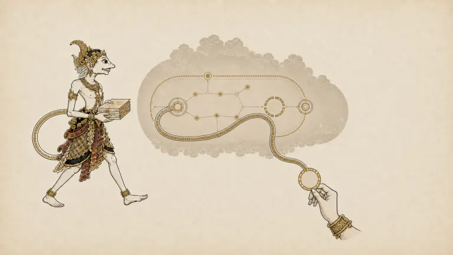
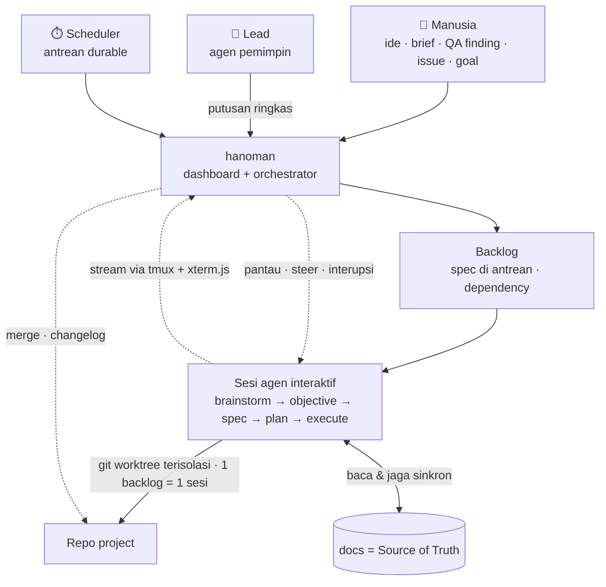
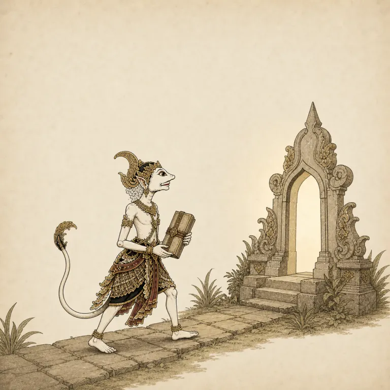
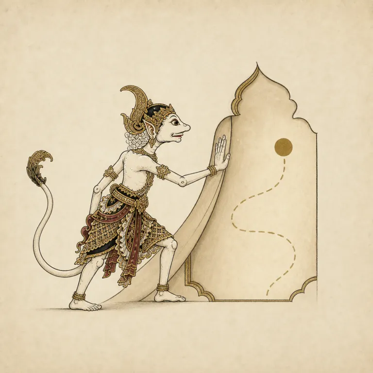
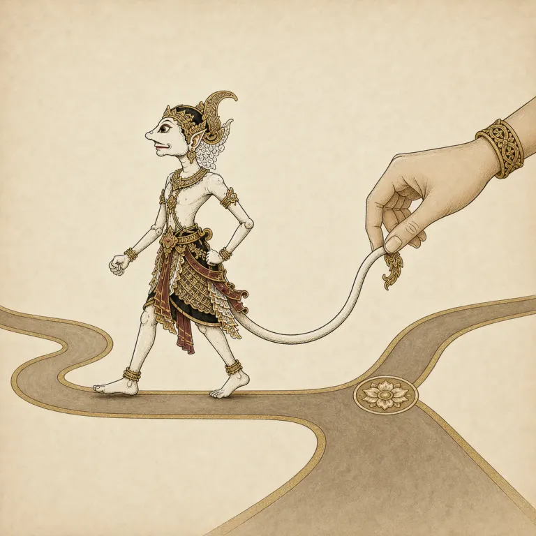
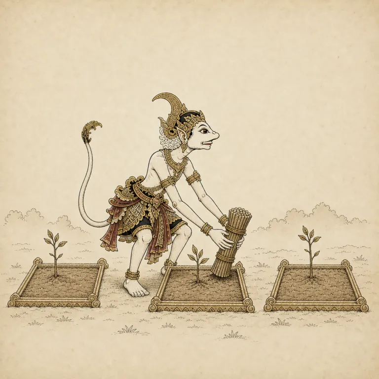
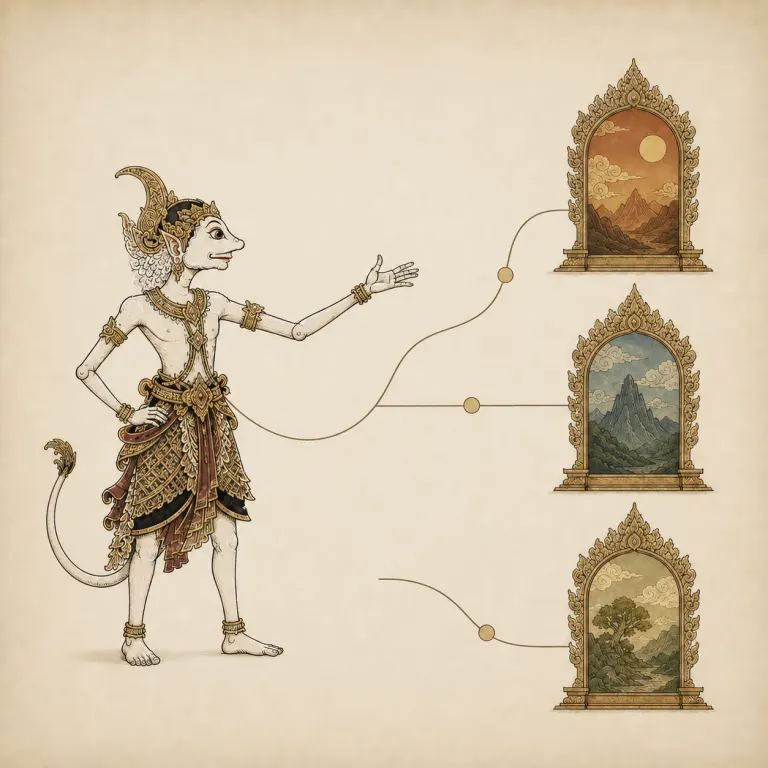
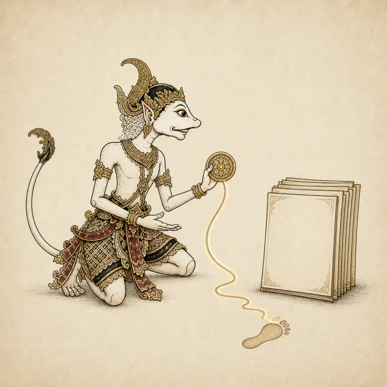
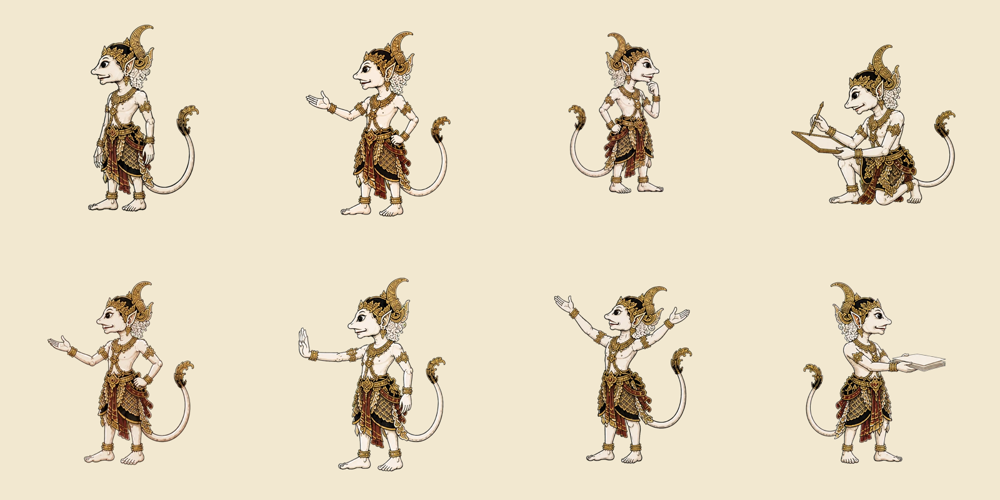
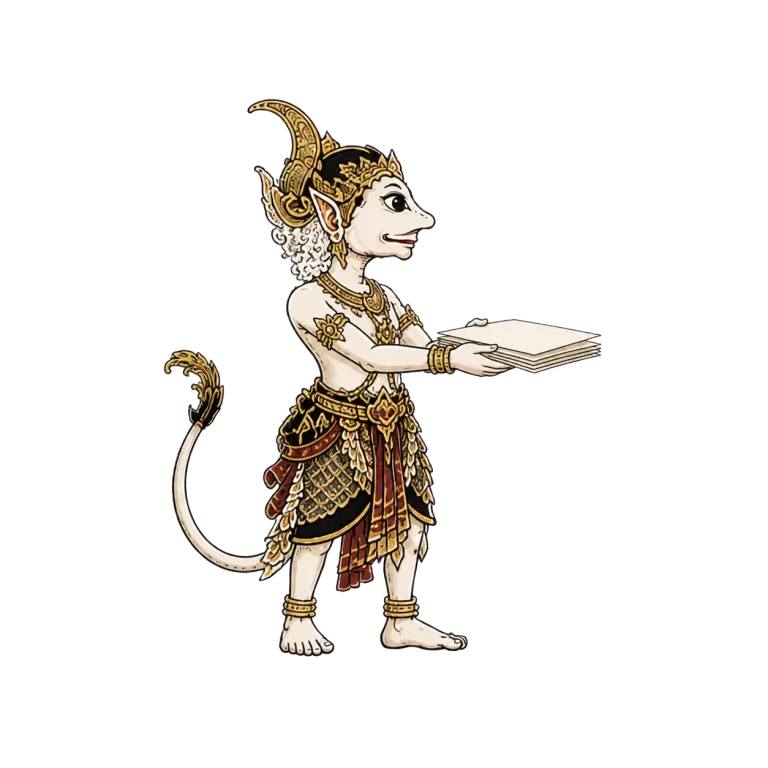

<div align="center">


# hanoman

**Control room untuk menjalankan & memantau coding agent di banyak project sekaligus — dengan dokumentasi sebagai Source of Truth.**

<sub>Kekuatan yang mengemban amanat. · *Power in service of intent.*</sub>

[](https://www.npmjs.com/package/hanoman)
[](https://nodejs.org/)
[](LICENSE)

</div>

<div align="center">
  
</div>

<div align="center">
  
</div>

## Apa itu hanoman?

hanoman adalah **orchestrator + dashboard** untuk pengembangan yang digerakkan dokumentasi.
Kamu menuang ide (brief), memfilekan bug (QA finding), menarik issue GitHub, atau sekadar
menyebut sebuah tujuan; hanoman menjalankannya sebagai **sesi agen interaktif**
([Claude Code](https://claude.com/claude-code) atau [Codex](https://developers.openai.com/codex/cli))
yang mengerjakan tiap fase — brainstorm → objective → spec → plan → execute — di dalam **git
worktree terisolasi**, satu per backlog item. Kamu memantau semua sesi secara realtime dari satu
tempat, dan bisa menyetir atau menginterupsi kapan pun. Dokumentasi project (`internal/docs/**`)
adalah **Source of Truth**: sumber kebenaran yang menjaga tiap langkah tetap jujur.

## Cara kerjanya



Kerja **fitur** lewat alur `brainstorm → objective → spec → plan → execute`.
Kerja **QA** lewat alur `audit → spec → plan → execute` (akar masalah dulu, baru perbaikan).
Kerja **goal** berjalan dua fase dengan mode goal native milik agennya.
"Fase" bukan proses terpisah — ia **giliran** di dalam satu sesi, jadi konteks terbawa utuh dari
awal sampai selesai.

## Konsep inti

<table>
<tr>
<td width="96"></td>
<td><b>Konteks terbawa.</b> Docs project adalah Source of Truth: <code>internal/docs/**</code> diperbarui pada commit yang menyentuhnya — kebenaran secara konvensi, dijaga alur kerja, bukan gerbang mekanis.</td>
</tr>
<tr>
<td></td>
<td><b>Kerja terlihat.</b> Tiap sesi adalah terminal sungguhan yang bisa ditonton, disetir, dan dilanjutkan — bukan kotak hitam yang cuma melapor di akhir.</td>
</tr>
<tr>
<td></td>
<td><b>Manusia pegang kendali penuh.</b> Bahkan saat berjalan otomatis, tiap sesi bisa dijawab atau diinterupsi. hanoman berhenti dan bertanya hanya saat butuh keputusan manusia yang nyata.</td>
</tr>
<tr>
<td></td>
<td><b>Isolasi via git worktree.</b> Tiap backlog dikerjakan di worktree-nya sendiri (<code>&lt;repo&gt;/.worktrees/&lt;id&gt;</code>), tak pernah di working tree utama. <b>Satu backlog = satu sesi.</b></td>
</tr>
<tr>
<td></td>
<td><b>Banyak sesi sekaligus.</b> Beberapa backlog di beberapa project berjalan berdampingan, dengan dependency antar-backlog dan auto-merge opsional saat sesi selesai.</td>
</tr>
<tr>
<td></td>
<td><b>Pengetahuan bertahan.</b> Spec, plan, ADR, riwayat sesi, dan changelog tetap ada setelah sesinya tutup — project baru di-scaffold dari nol, codebase lama di-<i>reverse-engineer</i> docs-nya lebih dulu.</td>
</tr>
</table>

## Sekilas layar

| Backlog — spec dari brief/QA/issue, progres tiap tahap | Terminal — sesi agen interaktif |
|---|---|
|  |  |

**Source of Truth** — docs project di-index & dipantau drift-nya:


## Isi dashboard

| Layar | Untuk apa |
|---|---|
| **Overview** | denyut semua project: sesi hidup, backlog, notifikasi |
| **Projects** | daftar project + binding repo lokal, rename, konfigurasi per project |
| **PRD** | dokumen produk level project; bisa dipecah otomatis jadi backlog paralel |
| **Backlog** | antrean spec (brief · QA · audit · goal · issue), dependency, dan stage tiap item |
| **Triase** | tiket Help Center & issue GitHub masuk → diputuskan → jadi backlog |
| **Scheduler** | otonomi terjadwal: antrean durable, cap concurrency, pembatalan |
| **Lead** | `hanoman-lead` — agen pemimpin yang memutuskan lalu melapor; manusia jadi pembatal |
| **Terminal** | sesi agen di tmux, streaming lewat xterm.js, plus riwayat & transkripnya |
| **IDE** | editor + git graph: review diff, rebase/merge, hapus branch |
| **VPS** | modul operasi server: konsol SSH, katalog kepatuhan, remediasi dry-run |
| **Docs · SoT** | index Source of Truth, coverage, pratinjau & unduh `.md`/`.pdf` |
| **Changelog** | rilis per project, dinarasikan agen dari backlog yang selesai |
| **Settings** | mesin & model sesi, custom agent, token agen, webhook, Telegram, sync |

## Integrasi

- **Agent token + capability per-domain** — akses `/api` untuk agen luar, dibatasi per domain.
- **MCP** — `hanoman mcp` menyajikan **17 tool** dengan capability yang sama, lewat stdio.
- **Telegram** — operator bisa menyetir sesi dari chat, kredensialnya tersimpan terenkripsi di Settings.
- **Webhook keluar** — peristiwa ber-versi, diantrekan di SQLite.
- **Sync multi-device** — hub ↔ client server-to-server, change-feed ber-versi, konflik direkonsiliasi.
- **Help Center** — endpoint tiket publik ber-scope project, dengan link status yang bisa dibagikan.

## Untuk AI agent

Panduan lengkap supaya agen mana pun bisa langsung memakai hanoman — cukup diberi **tautan + satu
agent token**, tanpa penjelasan tambahan dari manusia:
**[docs/agent-integration.md](docs/agent-integration.md)**.

Isinya: model kerja hanoman (backlog → sesi → worktree), autentikasi `Bearer hnm_agt_…`, capability
per-domain dan arti 403, endpoint tersering + bentuk payload `POST /specs`, tindakan berbahaya yang
wajib dikonfirmasi manusia, jebakan yang sudah diketahui, dan alur end-to-end siap salin.

Instance hanoman yang berjalan menyajikan **naskah yang sama** sebagai markdown mentah, tanpa auth —
jadi agen bisa membacanya sendiri:

```bash
curl -fsS https://hanoman.example/api/agent-integration.md
```

## Pasang sebagai paket npm

Terbit di npm sebagai **[`hanoman`](https://www.npmjs.com/package/hanoman)** — satu perintah, tanpa
clone repo:

```bash
npm i -g hanoman
hanoman doctor     # periksa prasyarat
hanoman            # jalan di http://127.0.0.1:8787
```

Pakai sekali tanpa memasang global: `npx hanoman`. Pengelola paket lain: `pnpm add -g hanoman` ·
`yarn global add hanoman` · `bun add -g hanoman`.

Buka URL-nya, buat akun pertama, selesai. Datanya di `~/.hanoman/` — SQLite embedded, **tanpa Docker,
tanpa Postgres, tanpa Redis** ([ADR-0086](internal/docs/adr/0086-sqlite-satu-satunya-provider.md) ·
[ADR-0087](internal/docs/adr/0087-distribusi-npm-global-satu-perintah.md)). Update: `hanoman update`,
atau tombol update di dashboard.

Yang npm **tidak** bisa bawa, karena itu inti produknya: `git` (worktree per sesi), `tmux` (sesi agen
selamat dari restart API, [ADR-0016](internal/docs/adr/0016-sesi-terminal-hidup-di-tmux.md)), dan CLI
agen `claude` dan/atau `codex` yang sudah login. `hanoman doctor` melaporkan mana yang belum ada.
Detail perintah & konfigurasi: [operations/npm-readme](internal/docs/operations/npm-readme.md).

## Mulai (dari checkout, untuk mengembangkan hanoman)

**Prasyarat:** Node.js ≥ 20 · [pnpm](https://pnpm.io/) · [tmux](https://github.com/tmux/tmux) ·
CLI agen ([Claude Code](https://claude.com/claude-code) dan/atau Codex) yang sudah login.

```bash
pnpm install
pnpm dev        # API (:8787) + dashboard (:5173)
```

Lalu buka **http://localhost:5173**, buat akun pada layar setup pertama, dan tambahkan project.

> DB dev adalah berkas SQLite (`DATABASE_URL=file:../../hanoman-dev.db` di `.env` — lihat
> `.env.example`), dimigrasi dengan `pnpm db:migrate`. Sesi memakai kredensial `claude`/`codex` yang
> sudah login di terminalmu. Merakit paket npm-nya: `pnpm release`.

## Brand & ilustrasi

<div align="center">
  
</div>

Maskotnya Hanoman sendiri — sang duta yang mengemban amanat: ia menyapa, mengamati, bekerja,
bertanya, memperingatkan, merayakan, dan membawa pengetahuan pulang. Sistem ilustrasinya berisi
**41 master WebP** dalam sembilan famili (model · hero · lakon · spot · product-state · pose maskot ·
sticker · social · diagram/motif), lengkap dengan perakit turunan web dan verifikator strukturalnya:

```bash
node internal/assets/illustration/build-web.mjs   # turunan web yang di-bundle frontend
node internal/assets/illustration/verify.mjs      # master + turunannya
```

Master tetap near-lossless sebagai arsip; yang masuk bundle — dan karenanya paket npm — adalah
turunan terkompres di `web/`: 38,8 MB → 1,5 MB.

- Aset & inventarisnya: [`internal/assets/illustration/`](internal/assets/illustration/README.md)
- Art direction, karakter, katalog, dan kriteria review: [`internal/docs/brand/illustration/`](internal/docs/brand/illustration/README.md)
- Brand book (empat lakon, voice, identitas visual): [`internal/docs/brand/`](internal/docs/brand/README.md)

Di frontend, aset dipakai lewat registry bertipe (`src/src/ds/illustration-registry.ts`) dan komponen
`Illustration` di design system — product-state sudah terpasang di layar-layar kosong/aktif dashboard.

## Struktur repo

```
src/               dashboard (React + TypeScript + Vite, xterm.js)
server/            orchestrator: Fastify · Prisma/SQLite · node-pty + tmux
runner/            library git-worktree + pembangun prompt + resolusi path data (bukan proses)
cli/               biner `hanoman`: start · doctor · update · mcp · migrate-from-postgres · docs
shared/            tipe, DTO, katalog agen/MCP dipakai bersama server ↔ web
internal/docs/     SOURCE OF TRUTH — baca ini lebih dulu
internal/assets/   master ilustrasi + turunan web + inventaris + verifikator
internal/skills/   skill project untuk agen (hanoman, hanoman-devops)
docs/              spec & plan kerja (superpowers) + aset README
.claude/           konfigurasi & hooks Claude Code
```

Stack: React + Vite · **Fastify** · SQLite (**Prisma 6**) · **node-pty + tmux** · xterm.js.
Realtime: WebSocket untuk terminal PTY, HTTP polling untuk sisanya.
Eksekusi adalah sesi agen interaktif per backlog di git worktree — tanpa message queue, worker,
maupun webhook GitHub (semuanya dicabut di
[ADR-0024](internal/docs/adr/0024-sesi-interaktif-menggantikan-run.md); scheduler kembali sebagai
engine in-process di [ADR-0072](internal/docs/adr/0072-scheduler-fondasi-engine-antrean-durable-cap.md)).

## Handoff ke agen

1. Baca `internal/docs/README.md` — index Source of Truth.
2. Ikuti `AGENTS.md` + `CLAUDE.md`, lalu skill project `internal/skills/hanoman/SKILL.md`.
3. Ambil spec dari **Backlog** di dashboard → **Buka sesi** → pantau di **Terminal**.

---

<div align="center">



<sub>Chiranjivi — docs (Source of Truth) abadi melampaui commit.</sub>

</div>
